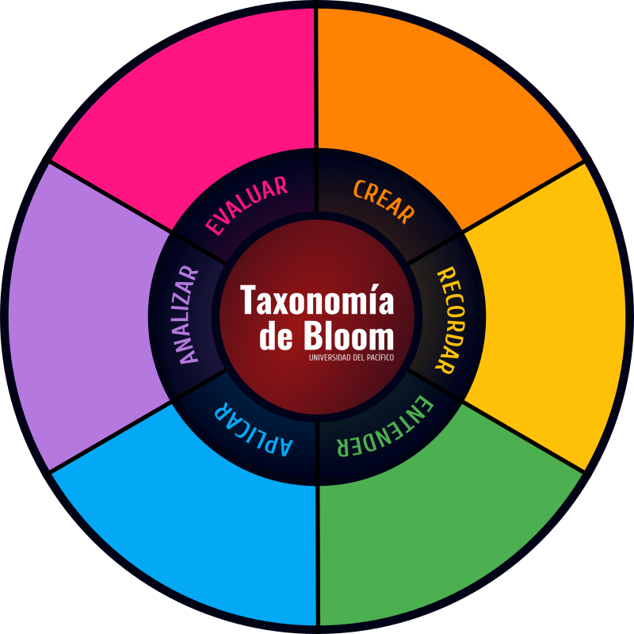

# Concreción Curricular - Programa de Ingeniería de Sistemas

Esta aplicación presenta el perfil de egreso de los estudiantes del programa académico de Ingeniería de Sistemas de la Universidad del Pacífico.

## Competencias del Programa

El primer nivel de concreción curricular alinea el perfil de egreso con las competencias. En este trabajo, se han agrupado las competencias del programa en las siguientes categorías:

- **Básicas**: Necesarias para enfrentar diversas situaciones de vida.
- **Generales**: Habilidades y capacidades para cualquier profesional.
- **Disciplinares**: Habilidades y capacidades específicas para desempeñarse en su campo profesional (ingeniería, salud, etc.).
- **Específicas**: Habilidades y capacidades propias del ingeniero de sistemas y aquellos elementos diferenciadores que identifican a nuestro profesional.

En el siguiente nivel, cada competencia se alinea con los Resultados de Aprendizaje del Programa (RAP) para asegurar una educación integral y pertinente.

## Taxonomía de Bloom

Los RAP se mapean en la rueda de la Taxonomía de Bloom, permitiendo visualizar cómo el programa fomenta el desarrollo de habilidades cognitivas, desde el recuerdo hasta la creación.

## Contribuciones

Este proyecto está abierto a contribuciones de la comunidad académica. Si tienes sugerencias o comentarios, por favor, comunícate a glucio@unipacifico.edu.co
